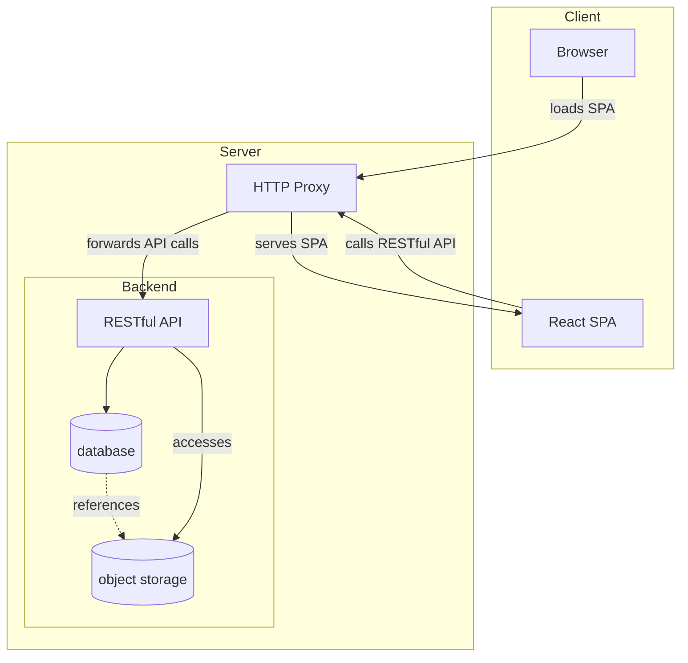

# web

[](https://github.com/fachschaftinformatik/web/releases/latest)
[](https://github.com/fachschaftinformatik/web/blob/main/go.mod)
[](https://github.com/fachschaftinformatik/web/actions/workflows/ci.yaml)

Website of the student representative body for computer science at Westphalian University.

If you believe you have found a security issue, please contact us at security@fsv-wh.de.

## Documentation

For the API spec please refer to [/docs](/docs). The live API documentation can be found [here](https://ik.fsv-wh.de/swagger/index.html).

### Architecture



The `database` holds all relevant meta data and references to the blobs. All blobs are stored in the S3 compatible `object storage`. For a more detailed overview have a look at the [initial SQL schema](https://github.com/fachschaftinformatik/web/blob/main/database/migrations/0001_initial_schema.sql).

## Getting started

For local development, run the Go API and MinIO via Docker Compose and the Vite frontend separately.  
The API serves data under `/api`, and the frontend consumes it in the browser.

```sh
docker compose up --build api minio
```

To build and run the frontend:
```
cd website
npm install
npm run dev
```

For more information on how to build the project, read [CONTRIBUTING.md](https://github.com/fachschaftinformatik/web/blob/main/.github/CONTRIBUTING.md#building).

The following environment variables are being used and should be set accordingly:

| Variable | Default | Notes |
| --- | --- | --- |
| `DOMAIN` | `http://localhost:3000` | The domain the frontend will be reachable at. Used for CORS, redirects and URL generation. |
| `SIGNUPS_ENABLED` | `true` | Wether or not new signups are allowed. |
| `SIGNUPS_VERIFY` | `true` | Wether or not to require signups to verify their email address. Requires the SMTP config from below to be set. |
| `SIGNUPS_DOMAINS_WHITELIST` | `studmail.w-hs.de,fsv-wh.de` | Whitelist of domains allowed to sign up. |
| `S3_ENDPOINT` | `minio:9000` | MinIO service endpoint. |
| `S3_BUCKET` | `development` | Name of the bucket. |
| `S3_USE_SSL` | `false` | Wether or not to use TLS for the S3 connection. |
| `S3_ACCESS_KEY` | `minio` | The S3 access key. |
| `S3_SECRET_KEY` | `password` | The S3 secret key. |
| `SMTP_HOST` |  | SMTP host. |
| `SMTP_PORT` |  | SMTP port. |
| `SMTP_USERNAME` |  | SMTP username. |
| `SMTP_PASSWORD` |  | SMTP password. |
| `SMTP_FROM` |  | SMTP address used for sending emails. |

## Contributing

If you wish to contribute to the this project, thank you!
Please refer to [CONTRIBUTING.md][1] for guidance.

## Legal

SPDX-License-Identifier: MPL-2.0

[1]: https://github.com/fachschaftinformatik/web/tree/main?tab=contributing-ov-file
